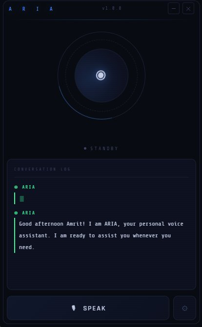

# ARIA — AI Voice Assistant

<div align="center">



<br/>

[](https://github.com/yourusername/aria)
[](https://github.com/yourusername/aria)
[](https://electronjs.org)
[](LICENSE)
[](https://github.com/yourusername/aria)

**A fully offline, zero-cost AI voice assistant for Windows — built with Electron.js, Whisper.cpp, and Windows native APIs.**

[Features](#-features) · [Architecture](#-architecture) · [Installation](#-installation) · [Usage](#-usage) · [Commands](#-commands) · [Tech Stack](#-tech-stack) · [Roadmap](#-roadmap)

</div>

---

## ✨ Features

- 🎙️ **Fully Offline Speech-to-Text** — Powered by OpenAI Whisper.cpp running locally on CPU
- 🔊 **Natural Text-to-Speech** — Uses Windows built-in Speech Synthesis (no API needed)
- 🧠 **Smart Command Parser** — Rule-based intent engine with fuzzy matching for mishears
- 🤖 **Confirmation System** — Asks for confirmation when unsure about a command
- 💬 **Synced Voice + Text** — Words appear in real-time in sync with ARIA's voice
- 🎨 **Sci-Fi UI** — Custom Electron frameless window with animated orb, wave bars, and scanlines
- 🔉 **Sound Effects** — Web Audio API tones for every interaction state
- 🌅 **Smart Greetings** — Time-aware greetings on launch and goodbye on close
- ⚡ **Zero Cost** — No paid APIs, no cloud, everything runs on your machine
- 🚀 **Auto-start** — Optional launch with Windows on boot
- 📦 **Installable** — Ships as a `.exe` installer with NSIS

---

## 🏗️ Architecture

```
voice-assistant/
├── main/                    ← Electron main process (Node.js)
│   ├── index.js             ← App entry, IPC handlers, voice pipeline
│   ├── autostart.js         ← Windows boot registration
│   └── preload.js           ← Secure IPC bridge to renderer
│
├── modules/                 ← Core engine (all offline)
│   ├── stt.js               ← Speech-to-Text via Whisper.cpp + Windows MCI recorder
│   ├── parser.js            ← Intent classifier + fuzzy matcher + confirmation state
│   ├── actions.js           ← Action executor (apps, search, system, info)
│   ├── tts.js               ← Text-to-Speech via Windows Speech Synthesis
│   └── localai.js           ← Optional Ollama local LLM bridge
│
├── renderer/                ← Frontend (HTML/CSS/JS)
│   ├── index.html           ← App shell
│   ├── styles.css           ← Sci-fi dark theme with animations
│   └── app.js               ← UI logic, word streaming, sound engine
│
├── tmp/                     ← Runtime audio files (gitignored)
├── assets/                  ← Icons, installer assets
└── whisper.cpp/             ← Whisper speech recognition engine (submodule)
```

### Voice Pipeline

```
Mic Input
    ↓  (Windows MCI Recorder via PowerShell)
WAV File (16kHz, mono, 16-bit)
    ↓  (whisper-cli.exe)
Raw Transcript Text
    ↓  (parser.js — regex + fuzzy matching)
Intent + Parameters
    ↓  (actions.js)
Result Text
    ↓  (tts.js + streamWords)
Voice Output + Synced Text (simultaneously)
```

---

## 💻 Installation

### Prerequisites

| Tool | Version | Download |
|------|---------|----------|
| Node.js | 18+ | [nodejs.org](https://nodejs.org) |
| Git | Latest | [git-scm.com](https://git-scm.com) |
| CMake | 3.10+ | [cmake.org](https://cmake.org/download) |
| Visual Studio Build Tools | 2022 | [visualstudio.microsoft.com](https://visualstudio.microsoft.com/visual-cpp-build-tools/) |
| SoX | 14.4.2 | [sourceforge.net/projects/sox](https://sourceforge.net/projects/sox/files/sox/14.4.2/) |

### Step 1 — Clone the repository

```bash
git clone https://github.com/yourusername/aria.git
cd aria
```

### Step 2 — Install Node dependencies

```bash
npm install
```

### Step 3 — Build Whisper.cpp

```bash
git clone https://github.com/ggerganov/whisper.cpp
cd whisper.cpp
mkdir build && cd build
cmake .. -DCMAKE_BUILD_TYPE=Release
cmake --build . --config Release
cd ../..
```

### Step 4 — Download Whisper model

```bash
cd whisper.cpp
curl -L -o models/ggml-base.en.bin https://huggingface.co/ggerganov/whisper.cpp/resolve/main/ggml-base.en.bin
cd ..
```

### Step 5 — Configure paths

Open `modules/stt.js` and update the paths:

```js
const WHISPER_PATH = 'YOUR_PATH/whisper.cpp/build/bin/Release/whisper-cli.exe'
const MODEL_PATH   = 'YOUR_PATH/whisper.cpp/models/ggml-base.en.bin'
```

### Step 6 — Run

```bash
npm start
```

---

## 🎯 Usage

1. **Launch ARIA** — it greets you with a time-aware message (Good morning / afternoon / evening)
2. **Click SPEAK** — hold and speak your command clearly
3. **Wait** — ARIA records for 5 seconds, transcribes, parses and responds
4. **Voice + Text sync** — response appears word by word in sync with ARIA's voice
5. **Confirmation** — if ARIA mishears, it asks "Did you say X?" — reply yes or no

---

## 📋 Commands

| Command | What to Say | Example |
|---------|------------|---------|
| 👋 Greet | `hi` / `hello` / `hey` | *"Hello ARIA"* |
| 📂 Open App | `open [app name]` | *"Open Chrome"* |
| 🔍 Search | `search for [query]` | *"Search for weather in Patna"* |
| ▶️ YouTube | `youtube [query]` | *"YouTube lo-fi music"* |
| 🌐 Website | `go to [website]` | *"Go to github.com"* |
| 🕐 Time | `what is the time` | *"What is the time"* |
| 📅 Date | `what is the date` | *"What is the date"* |
| 🌤️ Weather | `weather` | *"Weather"* |
| 🔊 Volume Up | `volume up` / `louder` | *"Volume up"* |
| 🔉 Volume Down | `volume down` / `quieter` | *"Volume down"* |
| 🔇 Mute | `mute` / `unmute` | *"Mute"* |
| 💤 Sleep | `sleep` | *"Sleep"* |
| 🔒 Lock | `lock screen` | *"Lock screen"* |
| 🔄 Restart | `restart` | *"Restart"* |
| ⛔ Shutdown | `shutdown` | *"Shutdown"* |
| 📋 List Commands | `list commands` | *"List commands"* |

### Supported Apps (Open by Voice)

Chrome · Brave · Firefox · Edge · Notepad · Calculator · Paint · CMD · Windows Terminal · File Explorer · Task Manager · VS Code · Spotify · Discord · Telegram · WhatsApp · Zoom · Teams · Slack · OBS · Steam · Word · Excel · PowerPoint · Outlook

---

## 🛠️ Tech Stack

| Layer | Technology | Purpose |
|-------|-----------|---------|
| Desktop Shell | [Electron.js](https://electronjs.org) v41 | Frameless desktop window |
| Speech-to-Text | [Whisper.cpp](https://github.com/ggerganov/whisper.cpp) | Offline transcription (base.en model) |
| Mic Recording | Windows MCI API via PowerShell | Audio capture without SoX dependency |
| Text-to-Speech | Windows `System.Speech.Synthesis` | Native female voice synthesis |
| Command Parsing | Custom regex + fuzzy matcher | Intent recognition with confirmation |
| Sound Effects | Web Audio API | Procedural tones, no audio files needed |
| UI Animations | CSS keyframes | Orb pulse, wave bars, word streaming |
| Local AI (optional) | [Ollama](https://ollama.com) + Phi-3/Mistral | Smart fallback responses |
| Installer | electron-builder + NSIS | Windows `.exe` installer |

---

## 🔧 Configuration

### Change your name

In `modules/actions.js`, replace `Amrit` with your name:

```js
// Search for "Amrit" and replace with your name
return `Good morning Amrit! ...`
```

### Change recording duration

In `main/index.js`:

```js
const text = await recordAndTranscribe(5000) // 5000ms = 5 seconds
```

### Add custom app aliases

In `modules/actions.js`, add to `APP_ALIASES`:

```js
'my app':   'myapp.exe',
'photoshop': 'photoshop',
```

### Add custom commands

In `modules/parser.js`, add a new intent:

```js
{ pattern: /play\s+music/i, action: 'PLAY_MUSIC' },
```

Then handle it in `modules/actions.js`:

```js
case 'PLAY_MUSIC':
  exec('start spotify')
  return 'Opening Spotify for you'
```

### Enable Ollama AI fallback

```bash
# Install Ollama from https://ollama.com
ollama pull phi3
```

Then uncomment the `queryLocalAI` call in `modules/actions.js`.

---

## 📦 Build Installer

```bash
npm run build
```

Output: `dist/ARIA Voice Assistant Setup 1.0.0.exe`

The installer includes:
- Terms & Conditions acceptance page
- Custom install directory selection
- Desktop & Start Menu shortcuts
- Auto-start registration option

---

## 🗺️ Roadmap

- [x] Offline Speech-to-Text (Whisper.cpp)
- [x] Natural Text-to-Speech (Windows SAPI)
- [x] Command parser with fuzzy matching
- [x] Confirmation system for mishears
- [x] Synced voice + text streaming
- [x] Smart time-aware greetings
- [x] Sound effects engine
- [x] Sci-fi animated UI
- [x] Auto-start on Windows boot
- [ ] Wake word detection ("Hey ARIA")
- [ ] Ollama local AI integration
- [ ] Gmail automation
- [ ] Browser automation (Puppeteer)
- [ ] Multi-language support
- [ ] Custom voice profiles
- [ ] Plugin system for custom commands
- [ ] Mobile companion app

---

## 📁 .gitignore

Make sure your `.gitignore` includes:

```
node_modules/
dist/
tmp/
whisper.cpp/build/
whisper.cpp/models/
*.wav
*.exe
.env
```

---

## 🤝 Contributing

1. Fork the repository
2. Create a feature branch — `git checkout -b feature/wake-word`
3. Commit your changes — `git commit -m "Add wake word detection"`
4. Push to the branch — `git push origin feature/wake-word`
5. Open a Pull Request

---

## 📄 License

This project is licensed under the ISC License. See [LICENSE](LICENSE) for details.

---

## 🙏 Acknowledgements

- [OpenAI Whisper](https://github.com/openai/whisper) — speech recognition model
- [whisper.cpp](https://github.com/ggerganov/whisper.cpp) — C++ inference engine
- [Electron.js](https://electronjs.org) — cross-platform desktop framework
- [Ollama](https://ollama.com) — local LLM runtime

---

<div align="center">

**Built with ❤️ by Amrit**

*ARIA v1.0.0 — 100% offline · zero cost · fully open source*

</div>
